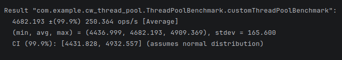
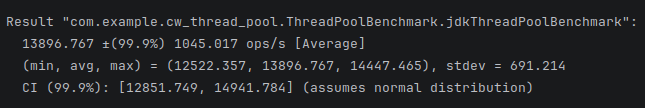
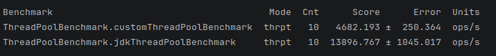

# Thread Pool

## Описание работы пула
В разработанном пуле потоков реализована стратегия распределения задач Round Robin с использованием изолированных очередей для каждого рабочего потока.

Принцип работы: входящий поток задач циклически распределяется по очередям воркеров с использованием атомарной операции инкремента глобального индекса (rrIndex.getAndIncrement() % N). Это позволяет избежать блокировок (locks) на этапе постановки задачи в очередь, обеспечивая высокую скорость метода execute().

Ограничения балансировки: Данная стратегия обеспечивает лишь статическую балансировку нагрузки. Она не учитывает текущее состояние потоков (занят/свободен). В условиях неоднородной нагрузки (задачи разной длительности) возможно возникновение дисбаланса, когда одни потоки простаивают, а другие имеют заполненные очереди.

В отличие от стандартного ThreadPoolExecutor, использующего единую общую очередь для идеальной динамической балансировки, или ForkJoinPool с механизмом Work-Stealing, данная реализация жертвует пропускной способностью ради упрощения архитектуры и демонстрации работы с атомарными операциями и несколькими конкурентными очередями.

## Анализ производительности

В ходе нагрузочного тестирования с использованием JMH было проведено сравнение пропускной способности разработанного пула потоков (CustomThreadPool) и стандартной реализации ThreadPoolExecutor из JDK.

Перед замерами был выполнен этап прогрева (Warmup) длительностью 3 итерации, необходимый для полной инициализации пулов (создание потоков, аллокация очередей) и оптимизации кода JIT-компилятором. Это позволило исключить влияние эффектов ‘холодного старта’ на итоговые показатели.

Результаты показали, что стандартный пул демонстрирует пропускную способность на уровне 13 897 ops/s, тогда как разработанный пул достигает 4 682 ops/s. Таким образом, CustomThreadPool уступает эталонной реализации примерно в 3 раза.

Статистическая погрешность результатов составила менее 8%, что подтверждает достоверность полученных данных.








## Запуск проекта
Запуск проекта
```
gradle run
```

Запуск тестирования
```
gradle jmh
```
